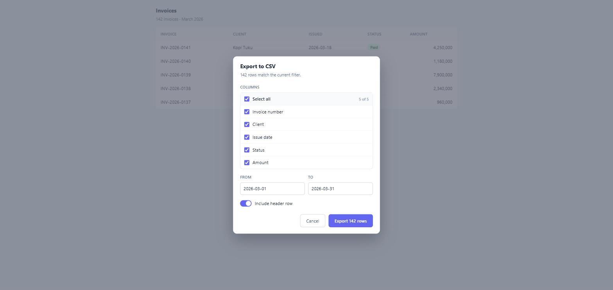
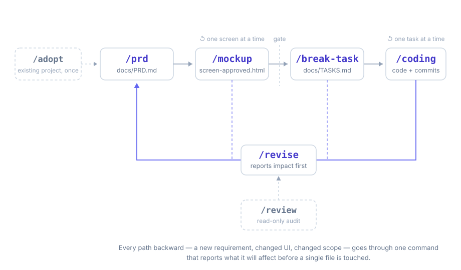

<p align="center"></p>
<h1 align="center">Mock-First</h1>
<p align="center"><em>Agree on the screen before you write the code.</em></p>
<p align="center">
  
  
</p>

> Not about test mocks — this is about UI mockups. See [FAQ](#faq).

<p align="center">
  
</p>
<p align="center"><sub>What <code>/mockup</code> produces: one self-contained HTML file you open in a browser and approve — <a href="docs/examples/export-dialog-approved.html">see the source</a>.</sub></p>

---

## The problem

Text PRDs get misread — what you wrote and what the model built from it can diverge, and
you usually only find out after the code is written. Plans that change mid-project leave
PRDs, task lists, and code quietly out of sync, with nothing telling you which task you
already checked off no longer matches reality.

## How it works

<p align="center">
  
</p>

Four commands move the work forward. One command (`/revise`) handles every path backward —
new requirements, changed UI, changed scope — by reporting exactly what it will affect
*before* touching a single file.

**Existing project?** Run `/adopt` once first. It scans the project read-only, detects the
stack and build commands, marks screens that already exist as `[existing]` so they
never get turned into tasks, and writes a baseline — without touching your existing PRD,
docs, or code.

**Lost the thread halfway through?** Run `/review`. It audits the PRD against the code and
reports what's done, what's half-done, what's missing, what exists but isn't in the PRD, and
which docs now contradict reality — with evidence for each, and changes nothing. Use it when
you don't yet know what to change; use `/revise` once you do.

## Install

Copy the command files into your global Claude Code commands folder:

```bash
mkdir -p ~/.claude/commands
cp commands/*.md ~/.claude/commands/
```

Or as a project-local plugin, from this repo:

```bash
/plugin marketplace add gookkis/mock-first
/plugin install mock-first@mock-first
```

## 60-second walkthrough

1. `/prd` — answer a handful of questions one at a time; Claude offers up to 3 brainstormed
   options on the questions that matter (problem, features, scope, stack) and writes
   `docs/PRD.md`.
2. `/mockup` — Claude builds one self-contained HTML mockup of a screen from the PRD (no
   variants to choose between — it picks a direction and says why). You open it in a browser;
   anything off gets fixed in the same file, then it's saved as
   `docs/mockups/<screen>-approved.html`.
3. `/break-task` — reads the approved mockups and PRD, breaks the work into a checklist at
   `docs/TASKS.md`.
4. `/coding` — works one task at a time: implement, build, show a short diff summary,
   wait for your OK, commit only the files that task touched, check the box.
5. Plans change? `/revise` — categorizes the change, reports impact (which tasks become
   outdated, which commits are affected) and waits for your decision before editing
   anything.

The same walkthrough in full, with the actual output at each step:
[docs/examples/walkthrough.md](docs/examples/walkthrough.md).

## What makes it different

- **Mockup is a gate, not an option.** `/break-task` won't break a screen into tasks until
  it has an approved mockup.
- **`/revise` reports impact before it changes anything.** PRD sections, mockups, tasks
  (done and pending), and affected commits — listed before any file is touched.
- **Nothing is deleted.** Superseded tasks are marked `⚠️ SUPERSEDED`, not removed. Old mockups
  and PRDs move to `archive/`, not overwritten.

## Not the same as...

Spec Kit, ShipSpec, and others do PRD → tasks → code well, with more mature tooling. Mock-First
adds the visual gate and the change-impact command. If you don't need those, use them — they're
more mature. Full comparison in [docs/COMPARISON.md](docs/COMPARISON.md).

## Android multi-module variant

For an existing Android project organized as multiple Gradle modules and multiple apps (an
"apps factory"), see [`variants/android-factory/`](variants/android-factory/). It adds
`/mock-first:adopt` (one-time bootstrap that scans `settings.gradle`/`build.gradle` and
builds a module → app dependency map at `docs/INDEX.md`) and `/mock-first:new-app`, and
scopes every other command to `app:<name>`, `core:<module>`, or `module:<:gradle:path>` so a
shared-module change can be reported against every app that depends on it.

Every module gets its own documentation folder automatically — `PRD.md` (product scope),
`MODULE.md` (responsibility, dependencies, public API surface, folder layout, build command),
and `TASKS.md`. `/mock-first:docs` generates and refreshes them from the Gradle and source
scan; `--check` runs a read-only audit for modules without docs, orphaned docs, changed
dependencies, and stale entries. The other commands keep it in sync on their own: a module
created during `/mock-first:coding` is registered and documented before the commit, and its
`MODULE.md` is staged alongside the code that changed it.

## Play Store companion (Android)

[`variants/play-store/`](variants/play-store/) adds a second command set for the same
multi-app project: capture screenshots at Play Store sizes, render them into marketing
images with device frame, background, and caption, write the store listing per locale, and
audit it for ASO. Start with `/play-store:doctor`, which checks that the JDK, Android SDK,
emulator, Node.js, and Playwright are installed and prints install commands for whatever
is missing. Then `/play-store:capture`, `/play-store:enhance`, `/play-store:listing`, and
`/play-store:aso` take one app module from raw ADB captures to an uploadable
`fastlane/metadata/android/` folder and a scored ASO report.

[`variants/portfolio/`](variants/portfolio/) closes the loop: `/portfolio:publish <app>`
turns that listing and those images into a portfolio entry on a personal Astro site (one
Markdown file per locale plus a cover, validated against the site's content-collection
schema, committed in the site repo), `/portfolio:privacy <app>` writes the app's privacy
policy page from what the code actually does (permissions, SDKs, accounts, local data)
along with a Play Console Data Safety summary, and `/portfolio:sync` reports which apps
have no entry yet or an entry older than its sources.

## Configuration

Command files are plain markdown with YAML frontmatter (`description`, `allowed-tools`).
Edit them directly — under `commands/` for the base workflow, or
`variants/android-factory/` for the Android set — to match your stack's build commands,
commit message convention, or task phases. See [docs/CONCEPT.md](docs/CONCEPT.md) for the
design rationale behind each command.

## FAQ

**Is this about test mocks (like Mockito or gomock)?** No. "Mock" here means UI mockup — the
visual sketch of a screen, reviewed in a browser before any code is written.

**Does `/coding` ask for confirmation on every file edit?** No — it asks once per task,
before committing. Pair it with an `allow`/`ask` permission split in `.claude/settings.json`
if you want fewer interruptions during implementation.

**Can I skip `/mockup`?** `/break-task` will tell you which screens are missing an approved
mockup and let you proceed anyway if you choose to.

**What if I already have a PRD?** `/prd` won't overwrite an existing `docs/PRD.md` — it asks
whether to add to it or archive it. For an Android apps-factory project that already has one
PRD for the whole factory, run `/mock-first:adopt` instead.

## License

MIT — see [LICENSE](LICENSE).
